# **Nesne Erişim Yetkileri ve Yönetimi**
Linux işletim sisteminde her dosya ve dizin, belirli bir kullanıcı ve grup tarafından sahiplenilir ve belirli erişim izinleriyle korunur. Bu erişim izinleri, sistemdeki kullanıcıların hangi işlemleri gerçekleştirebileceğini belirleyen temel güvenlik mekanizmalarından biridir.

## **Nesneler ve Aitlikleri**
- Dosya ve dizinlerin (objelerin) erişim yetkileri ls -l <nesne> komutuyla görüntülenebilir.
ls komutu bir dizin için olduğu gibi bir dosya için de kullanılabilir. 

- Bir objenin tipi, listelemedeki ilk hanede, – veya d karakterleriyle ifade edilir.

- Aşağıdaki görselde mavi ile işaretlenmiş bölümde \- karakteri nesnenin bir dosya, d karakteri ise nesnenin bir dizin olduğunu ifade eder.

- Bir nesnenin aitliği, kullanıcı ve grup olarak iki şekilde ele alınır.
Aşağıdaki görselde, listedeki tüm nesnelerin (sırasıyla) master kullanıcısı (yeşil kısım) ve master grubuna (turuncu kısım) ait olduğu görülmektedir.

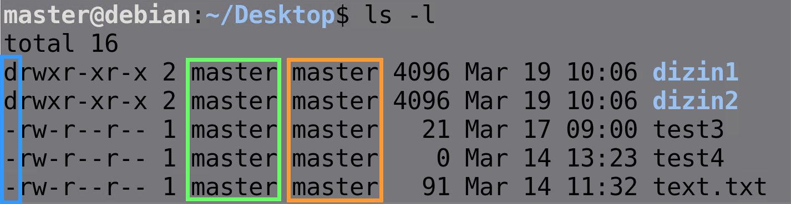

- Aitlik `chown user:group <nesne>` komutuyla    değiştirilir. 

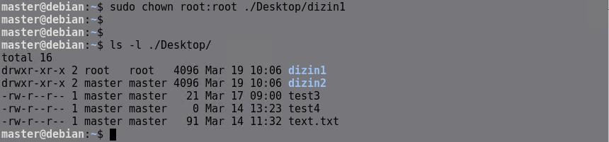


## **Yetki Haneleri ve İfadeleri**

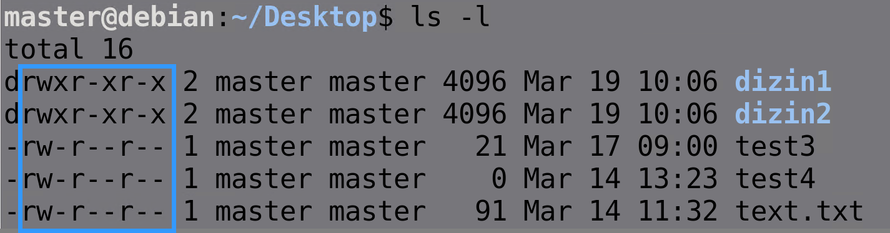

Mavi ile işaretlenen bölüm yetkilerin bilirtildiği bölümdür. Yetkilerdeki harflerin ne anlama gelidiği tabloda gösterilmiştir.

| Karakter | Anlamı |
|----------|--------|
| **r**    | Read anlamındadır. Nesnede okuma yetkisi bulunduğunu belirtir. |
| **w**    | Write anlamındadır. Nesnede yazma yetkisi bulunduğunu belirtir. |
| **x**    | Execute anlamındadır. Nesnede çalıştırma yetkisi bulunduğunu belirtir. |
| **-**    | Nesnede ilgili hane için bir izin bulunmadığını belirtir. (İlk hanedeki tireyle karıştırmayınız.) |


Nesneler için yetki ifadeleri toplam 9 adettirler ve 3 bölümden oluşurlar.

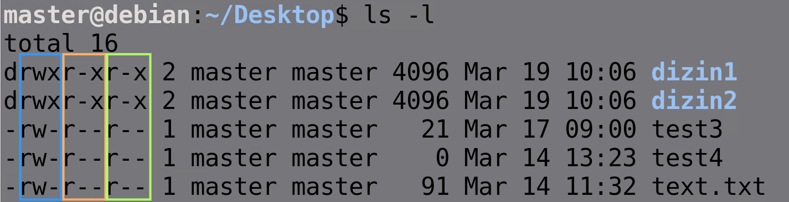

1. bölüm (mavi) kullanıcının yetkilerini belirler. r (okuma), w (yazma), x (çalıştırma). 

    Kullanıcı yetkileri derken bahsedilen [Nesneler ve Aitlikleri](#nesneler-ve-aitlikleri) bölümünde bahsedilen nesnenin ait olduğu kullanıcı.


2. bölüm (turuncu) grubun yetkilerini belirler. r (okuma), w (yazma), x (çalıştırma). 

    Gurubun yetkileri derken bahsedilen [Nesneler ve Aitlikleri](#nesneler-ve-aitlikleri) bölümünde bahsedilen nesnenin ait olduğu grup.

3. bölüm (yeşil) diğerlerinin (others) yetkilerini belirler. r (okuma), w (yazma), x (çalıştırma).


## **Nesne Erişim Yetkilendirmeleri**

Dosya ve dizinlerin (nesnelerin) erişim yetkileri chmod komutuyla değiştirilir.

Kullanımı (syntax’ı) şu şekildedir:
```
chmod <bölüm> <işlem> <yetki> <nesne>
```

**Bölüm** : **u** (user) , **g** (group) , **o** (others) , **a** (all)  

**İşlem** : **+** (ekleme) , **-** (çıkarma) , **=** (eşitleme )

**Yetki** : **r** (read) , **w** (write) , **x** (execute) 

**Nesne** : Dizin veya Dosya

Aşağıdaki görselde ilk olarak `a=` ile dizin1 için bütün kullanıcı ve gruplar için yetkiler kaldırılmıştır, ardından `u+rx` ifadesiyle kullanıcıya okuma ve çalıştırma yetkisi verilmiştir. Sonraki adımlarda ise diğer kullanıcılar için tüm yetkiler ve grup için sadece yazma yetkisi verilmiştir.

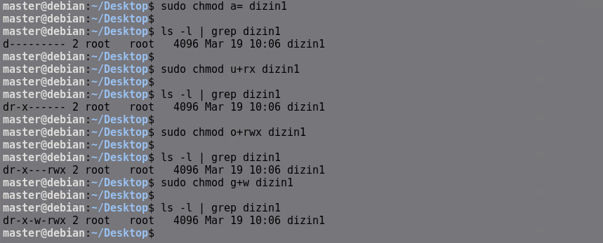

Bir başka örnekte ilk olarak diğer kullanıcıların izinleri sıfırlanıyor, daha sonra `getfacl` komutuyla dizin1 nesnesinin yetkileri inceleniyor ve diğer kullanıcı olan master kullanıcısı ile dizin1'e erişilmeye çalışılıyor ancak yetkisiz olduğu için başarılı olamıyor.

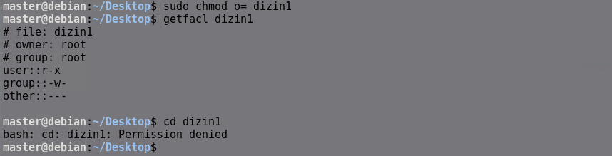

Aşağıdaki görselde gerekli iznden sonra master kullanıcısının dizin1'e erişebildiği gösterilmiştir.

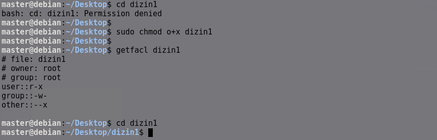


## **Octal-Mode ile Yetkilendirme**

Yetkiler, rakamlarla da sayısal olarak ifade edilebilirler. Buna Octal-Mode adı verilir.


| Yetki | Sayısal İfadesi |
|-------|----------------|
| **r** | 4 |
| **w** | 2 |
| **x** | 1 |
| **-** | 0 |


İlgili bölümün yetki rakamları toplanır. Toplam sayı, ilgili bölümün yetkilerini octal-mode’da ifade eder.

Octal-Mode’da görebileceğiniz, kullanabileceğiniz toplam 7 tane olasılık vardır

| Olası Yetki Kombinasyonu | Octal-Mode Hesabı | Octal-Mode Değeri |
|--------------------------|-------------------|-------------------|
| **rwx** | 4 + 2 + 1 | 7 |
| **rw-** | 4 + 2 + 0 | 6 |
| **r-x** | 4 + 0 + 1 | 5 |
| **r--** | 4 + 0 + 0 | 4 |
| **-wx** | 0 + 2 + 1 | 3 |
| **-w-** | 0 + 2 + 0 | 2 |
| **--x** | 0 + 0 + 1 | 1 |

Her bir rakam, bir bölümü temsil edecektir. (Sayı tüm bölümleri temsil eder.)

```
chmod 777 test.txt
``` 
Yukarıdaki komut test.txt dosyasına herkes için rwx yetkisi verilmiş olur.
```
chmod 543 test.txt
``` 
Yukarıdaki komut test.txt dosyasına için r-x group için r-- ve others için -wx yetkisi verilmiş olur.

```
chmod 163 test.txt
``` 
Yukarıdaki komut test.txt dosyasına user için --x 
group için rw- ve others için -wx yetkisi verilmiş olur.

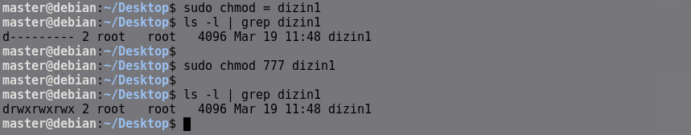


Aşağıda belirli yetkilendirmeye sahip nesnelerin bulunması için kullanılan komut verilmiştir. Komutun çıktısına göre kök dizinin altında 777 yetkilendirmeye sahip 60530 nesne (dizin,dosya) vardır.


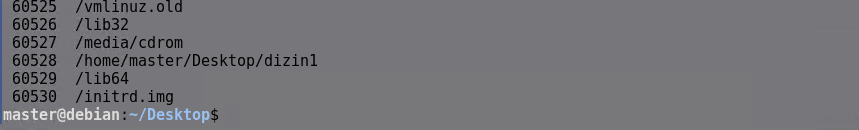


## **setfacl ile Ayrıntılı Yetkilendirme**

Aşağıda oluşturulan test.txt dosyasına ahmet kullanıcısı için özel yetkilendirme yapılmıştır.

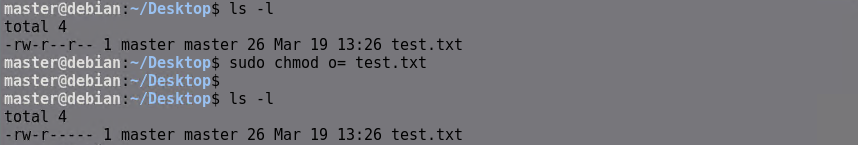
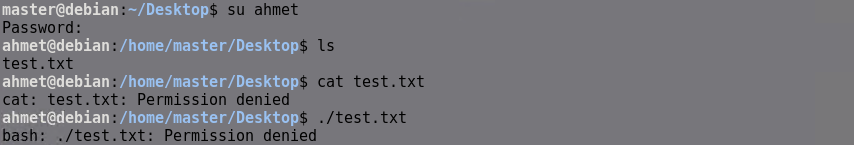
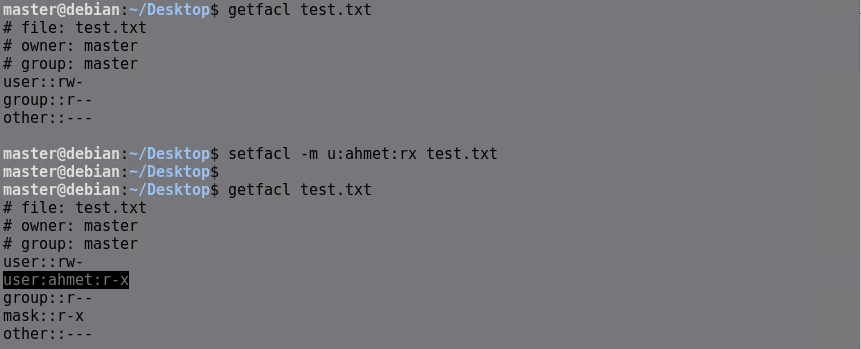
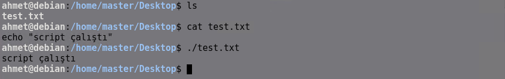

```
setfacl -x u:ahmet test.txt
```
komutu ile silinebilir.

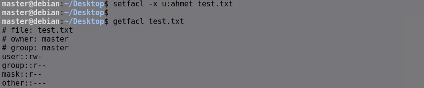

setfacl komutunun ayrıntılarını `setfacl --help` ile öğrenebilirsiniz.